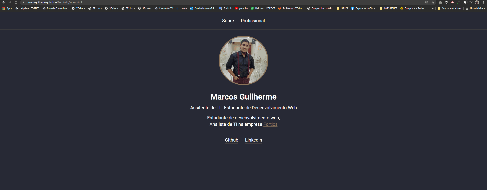

<h1 align="center">
  Portifolio
</h1>

<h3 align="center">
  Este é um portifolio simples inicial, a ideia e ir melhorando com o tempo
</h3>

  

## 🚀 Tecnologias

Esse projeto foi desenvolvido com as seguintes tecnologias:

- HTML
- CSS
- JS

## 💻 Projeto

E um simples portifolio criado para praticar os meus conhecimentos e aprimora-los em javaScript, CSS e HTML.

Veja o projeto funcionando através [deste link](https://marcosguilherm.github.io/Portifolio/)

